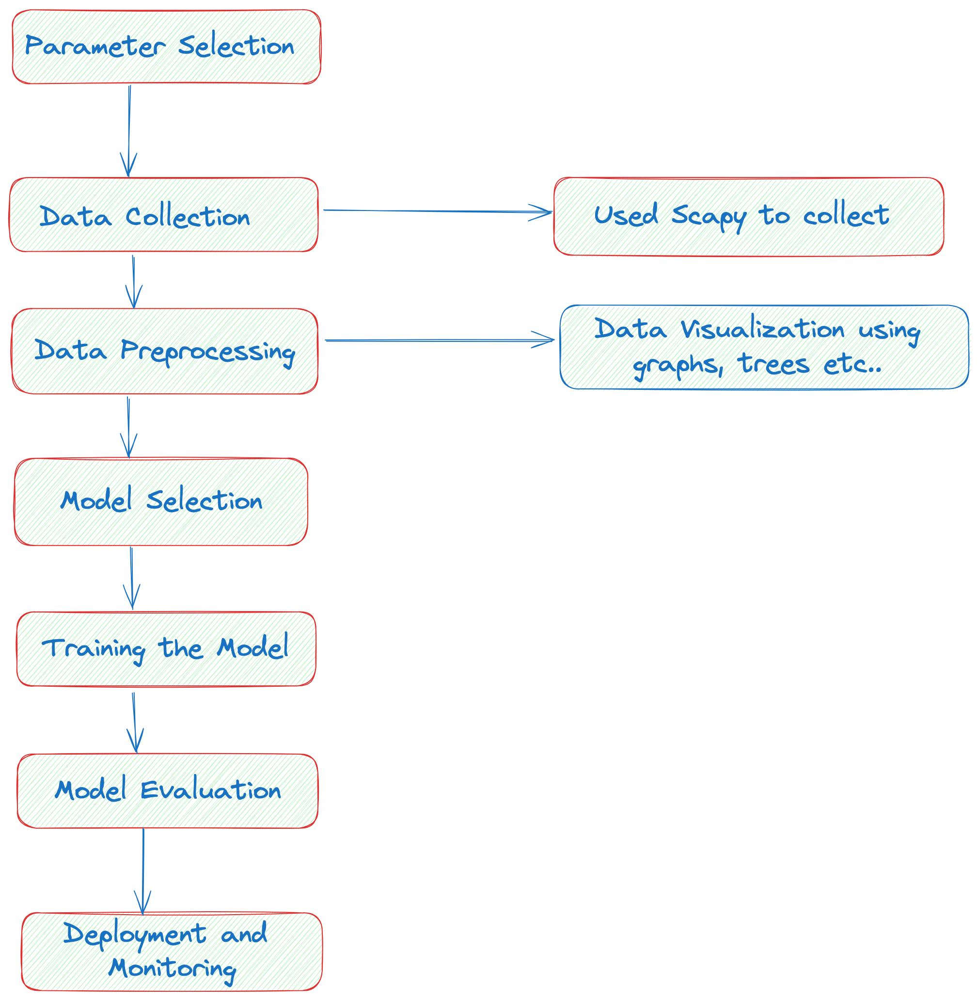

# Tracking Human Behavior Using Network Packet Headers

This repository focuses on analyzing network traffic data to track and infer human behavior patterns. By leveraging packet headers and various network-level metrics, the project explores how users interact with networks and aims to uncover underlying behaviors based on network packet analysis.

## Table of Contents
- [Introduction](#introduction)
- [Features](#features)
- [Installation](#installation)
- [Usage](#usage)
- [Analysis Metrics](#analysis-metrics)
  - [Packet-Level](#packet-level)
  - [Flow-Level](#flow-level)
  - [Session-Level](#session-level)
  - [Statistical](#statistical)
  - [Behavioral](#behavioral)
- [Optional Analysis](#optional-analysis)
- [Contributing](#contributing)
- [License](#license)

## Introduction

Network packet headers contain critical information that can be analyzed to understand network traffic and user behaviors. This project utilizes Python to analyze network packets, focusing on various packet-level, flow-level, and session-level metrics. The ultimate goal is to infer behavioral patterns such as access habits, geolocation, and temporal activity patterns.




## Features

- Analysis of unique source and destination IP addresses.
- Examination of source and destination ports.
- Distribution and variance analysis of packet sizes.
- Temporal analysis of packet inter-arrival times.
- Extraction of flow-level statistics, including byte counts and flow direction.
- Behavioral insights derived from session-level and statistical metrics.

## Installation

To use this repository, clone the repo and install the necessary dependencies:

```bash
git clone https://github.com/MayankDemblaUcm/humanbehaviour.git
cd humanbehaviour
pip install -r requirements.txt
```

## Usage

Run the analysis by executing the main Python script:

```bash
python packet_analysis.py
```

This will generate visualizations and statistics based on the imported network traffic data.

## Analysis Metrics

### Packet-Level
- **Number of Unique Source IP Addresses**: Counts the unique source IP addresses.
- **Number of Unique Source Ports**: Identifies the unique source ports used.
- **Number of Unique Destination IP Addresses**: Counts unique destination IP addresses.
- **Number of Unique Destination Ports**: Identifies unique destination ports.
- **Number of Applications Used**: Detects the applications involved based on ports and IPs.
- **Packet Size**: Analyzes the distribution and variance of packet sizes.
- **Inter-Arrival Time**: Measures the time between consecutive packets.
- **Payload Data**: Examines contents of packet payloads (if unencrypted).

### Flow-Level
- **Flow Duration**: Total active time of a flow.
- **Number of Packets**: Total packets in a flow.
- **Number of Packets Received**: Total packets received in a flow.
- **Number of Packets Sent**: Total packets sent in a flow.
- **Byte Count Sent**: Total bytes sent in a flow.
- **Byte Count Received**: Total bytes received in a flow.
- **Flow Direction**: Direction of flow (e.g., inbound, outbound).

### Session-Level
- **Session Duration**: Total duration of user sessions.
- **Number of Sessions**: Total sessions initiated by a user.
- **Session Activity Pattern**: Temporal distribution of session activities.

### Statistical
- **Mean and Variance**: Calculates mean and variance of packet sizes, inter-arrival times, etc.
- **Entropy**: Measures entropy of packet sizes and arrival times.

### Behavioral
- **Access Patterns**: Identifies types of websites or services accessed.
- **Usage Frequency**: Examines frequency of access to certain types of content.
- **Temporal Patterns**: Analyzes time of day or week when the user is active.
- **Number of User Records in the Traffic Logs**: Tracks the total number of user records.
- **Geolocation**: Maps the geographic locations based on IP addresses.

## Optional Analysis

- **Length of Inserted Fingerprints**: Analyzes inserted fingerprints for traffic.
- **Typing Speed**: Infers typing speed from network data.
- **Mouse Speed**: Analyzes mouse movement speed based on packet timing.

## Contributing

Contributions are welcome! Please feel free to submit a Pull Request or open an issue to discuss any improvements or features you'd like to see.

## License

This project is licensed under the University of Central Missouri. 

---
